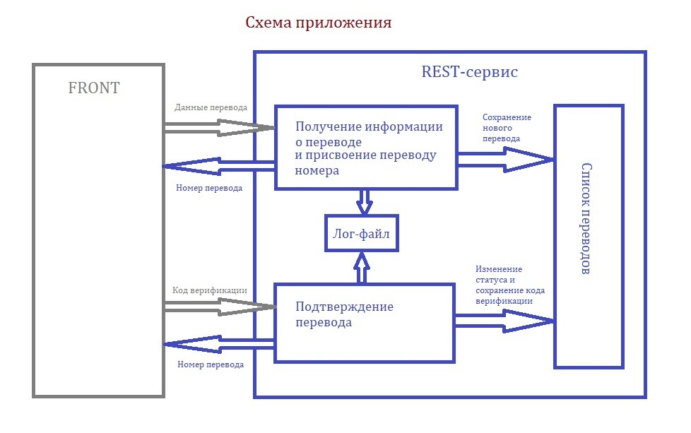
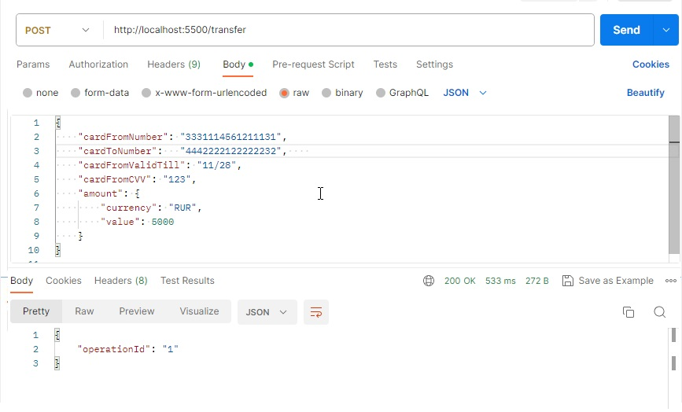
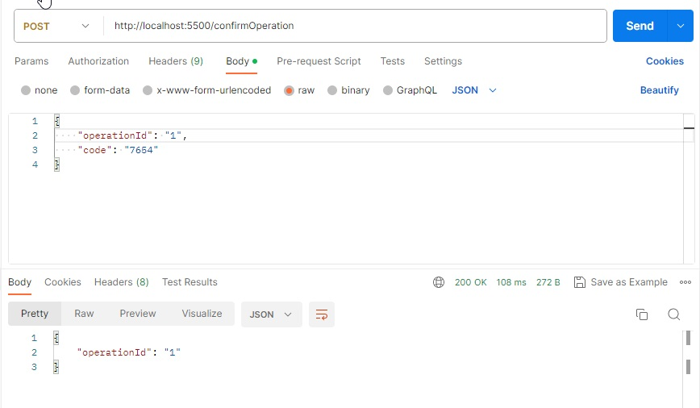
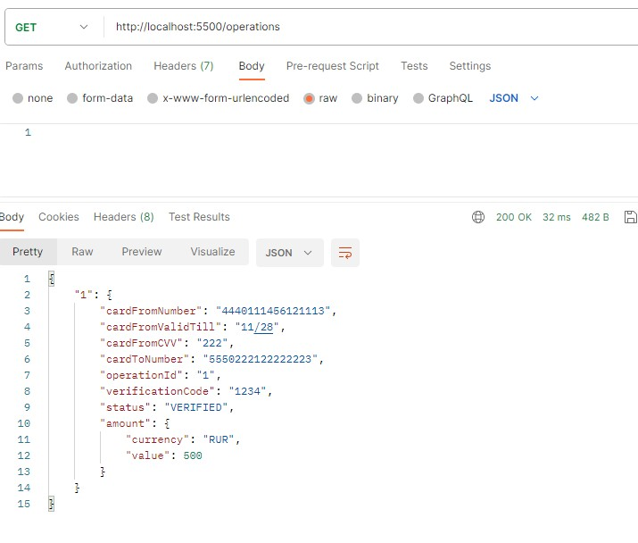

## Курсовой проект

# "Сервис перевода денег"

### Выполнила Лариса Черная

*Описание* 

Разработан REST-сервис, предоставляющий интерфейс для перевода денег с одной карты на другую [по заданой спецификации](https://github.com/netology-code/jd-homeworks/blob/master/diploma/MoneyTransferServiceSpecification.yaml).

Разработанный сервис взаимодействует с созданным сторонним разработчиком веб-приложением (FRONT) для использования его пользовательского интерфейса и функционала для перевода денег.

Сервис написан на языке Java с использоватем фреймворка Spring Boot.

Использован сборщик пакетов gradle.

*Функционал приложения "Сервис перевода денег"*

- Сервис предоставляет REST-интерфейс для интеграции с FRONT.
- Сервис реализовывает все методы перевода с одной банковской карты на другую, описанные [в протоколе](https://github.com/netology-code/jd-homeworks/blob/master/diploma/MoneyTransferServiceSpecification.yaml).
- Все изменения записываются в файл *transfer.log* — лог переводов с указанием:
   - даты;
   - времени;
   - карты, с которой было списание;
   - карты зачисления;
   - суммы;
   - комиссии;
   - статуса перевода.
  

*Архитектура приложения*

Приложение состоит из двух основных компонентов:
 - Сторона клиента (пользовательский интерфейс).
 - Серверная часть (бэкэнд) отвечает на HTTP-запросы, управляет бизнес-логикой и предоставляет доступ к данным. 

*Форматы данных*

Форматы данных ориентированы на форматы json-запросов приходящих с Front.

В json-запросе на создание перевода есть подузел, поэтому был создан класс *Amount* с атрибутами сумма (value) и валюта (current). 

В классе public class *TransferMoney* хранятся основные данные перевода: карты отправителя (номер, валидность и cvv), номер карты получателя, сумма-валюта (атрибут с типом Amount), номер операции и код верификации.

Для защиты от ошибочного ввода валюты, создано перечисление (Enum) Currency кодов доступных валют перевода.

В json-запросе на верификацию перевода передается код верификации, для этого был создан класс Code.

Список переводов хранится в мапе, ключом записи в которой является номер операции (перевода), а значением - объект с типом  TransferMoney.

*Настройки приложения*

Настройки приложения хранятся в файле application.properties в корне проекта.
Основной настройкой является нормер порта, с которым работает REST-сервис.

*Запуск приложения в докере*

В корне проекта находится подготовленный Dockerfile и docker-compose.yaml 

Из корневой папки проекта нужно открыть терминал и выполнить команду:

   ### docker-compose up -d 

После этого нужно запустить в браузере  приложение FRONT по ссылке https://serp-ya.github.io/card-transfer/ или приложение Postman и выполнить тестирование.

*Тестирование*

Все разработанные методы REST-сервиса покрыты юнит-тестами. 

Были разработаны тесты использующие тестконтейнер.

Также было выполнено тестирование с помощью Postman:
1) запрос на создание
   
POST http://localhost:5500/transfer

{ 
   
    "cardFromNumber": "4440111456121113", 
    "cardToNumber": "5550222122222223",     
    "cardFromValidTill": "11/28",
    "cardFromCVV": "222",
    "amount": {
        "currency": "RUR",
        "value": 500
    }
}

2) запрос на верификацию
   
POST http://localhost:5500/confirmOperation

{
    "code": "1234"
}

3) дополнительно для тестирования была реализована обработка GET запроса для получения списка переводов
   
GET http://localhost:5500/operations

